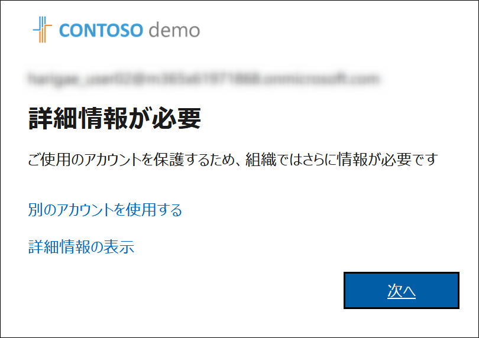
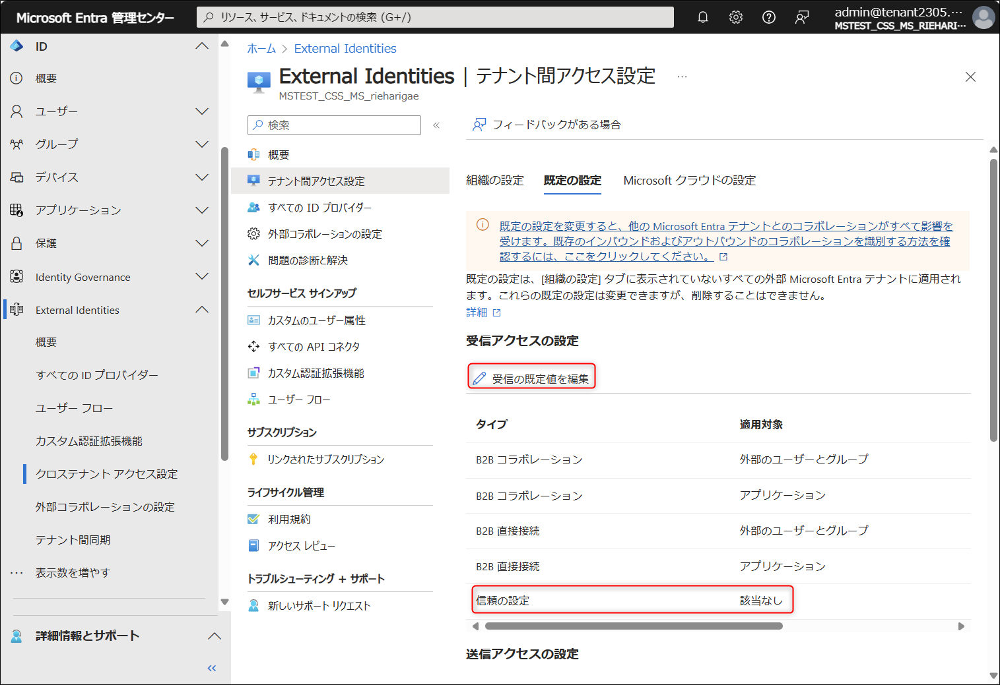
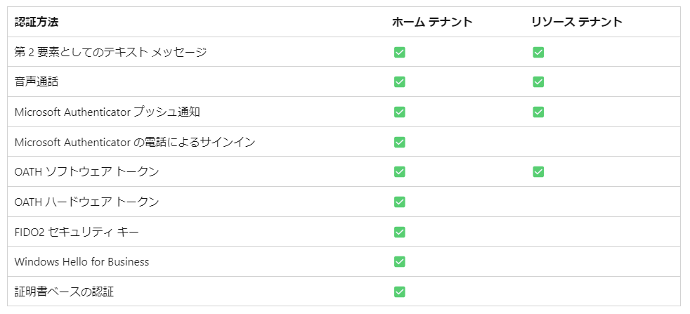
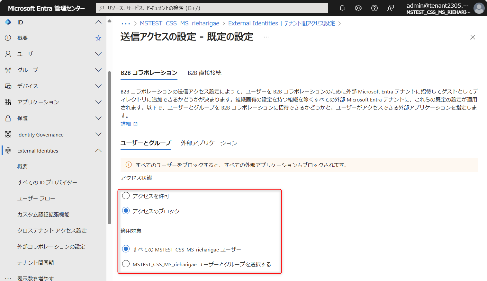
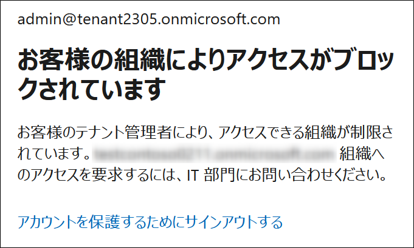
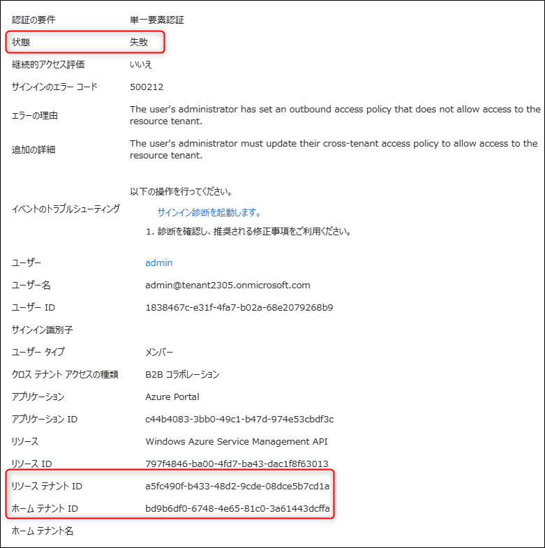
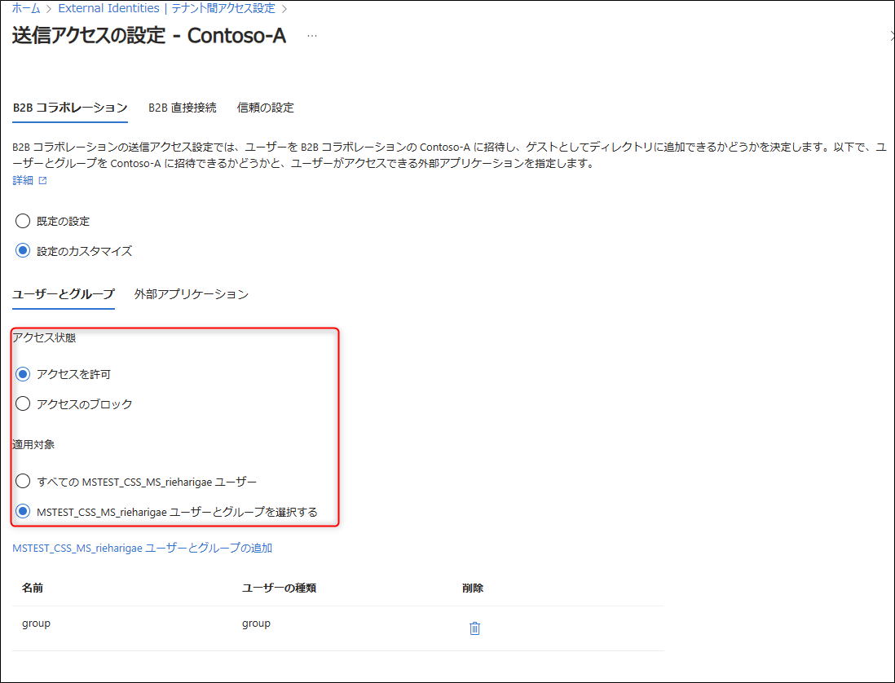
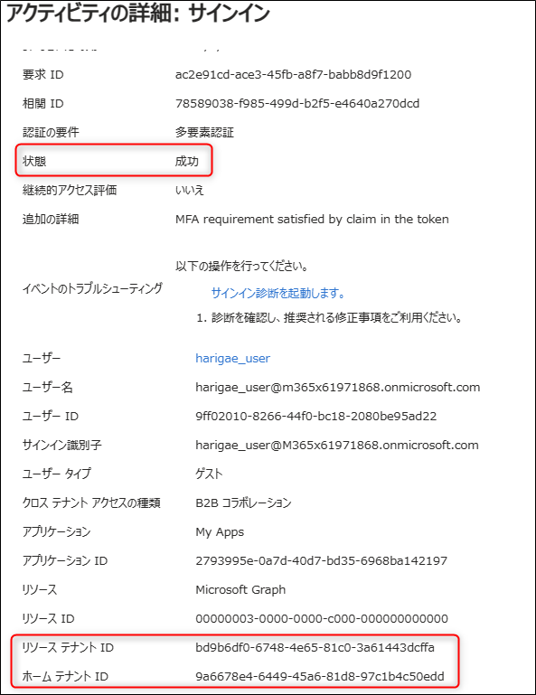

こんにちは、Azure Identity サポートチームの 張替 です。

本記事は、2024 年 3 月 18 日に米国の Azure Active Directory Identity Blog で公開された [Cross-tenant access settings - Notes from the field](https://techcommunity.microsoft.com/t5/microsoft-entra-blog/cross-tenant-access-settings-notes-from-the-field/ba-p/4081841) を意訳したものになります。ご不明点等ございましたらサポート チームまでお問い合わせください。

---

Microsoft Entra External ID のテナント間アクセス設定の登場により、組織が異なるテナント間でセキュリティとコラボレーションを管理する方法に極めて重要な変化が生じました。このブログ記事では、安全な B2B コラボレーションに向けたこれらの設定に着目し、その本質に迫っていきたいと思います。

本記事で着目するのは以下の 3 点です。

- 高いセキュリティと B2B ゲスト ユーザーのシームレスなユーザー エクスペリエンスの確保とのバランスを含め、認証プロセスを簡素化し、管理負担を軽減するという観点を強調しつつ、連携先で行われた多要素認証 (MFA) を信頼するということの是非について議論します。
- テナント間アクセス設定の詳細と、これらの設定によってテナント間のコラボレーションをよりきめ細かく制御する方法を紹介します。実際の利用例では、生産性とコラボレーションを妨げることなく、如何にセキュリティを確保しつつ、これらのポリシーを用いてアクセス管理と制限を行っていくかについて説明します。
- Microsoft Entra のテナント間アクセス ポリシーを活用することで、よりよいセキュリティとコラボレーションを実現し、スムーズなユーザー エクスペリエンスを実現するための知見についてお話します。

## ビジネス コラボレーター (B2Bコラボレーション) で行われた MFA を既定で信頼する

現在の、すべてがつながったデジタル環境では、多くの組織が業務フローを合理化し、外部パートナーとの協力を促進するために、B2B コラボレーションを採用するケースが増えています。このコラボレーション アプローチの一環として、多くの企業が Microsoft Entra のテナント内にゲスト ユーザー アカウントを作成し、信頼できるパートナーにリソースへのアクセスを許可しています。

セキュリティを強化するために、多くの企業はすでに MFA の要件を B2B ゲスト ユーザーにまで拡大していますが、この場合、テナントをまたがるアクセス シナリオにある外部ユーザーは、自テナントに加えて招待先のテナント (リソース テナント) でも追加の認証方法の登録が必要になります。

B2B ゲスト ユーザーがリソース テナントで追加の MFA 方式を登録することで、基本的にアカウントのセキュリティは向上しますが、同時に複雑さが増すことにもなります。

### B2B コラボレーション シナリオにおけるユーザー エクスペリエンスの混乱

ホーム テナントですでに MFA を登録し、Windows Hello for Business のような高度な MFA 方式の利便性に慣れている B2B ゲスト ユーザーがいたとして、そのユーザーがリソース テナントにアクセスしようとすると以下のように認証が一時的に中断されます。ユーザーがホーム テナントですでに強力な認証を実施済みの場合でも、リソース テナントで再度認証のプロンプトが表示されるのです。

### IT 部門とユーザーにのしかかる管理の負担

ゲスト ユーザーとリソース テナントの IT チームの両方が、追加の管理タスクに直面します。ゲスト ユーザーにとっては、新しく MFA をセットアップしなければいけませんし、追加の MFA 登録を管理することは煩わしいことです。テナント管理者とサポート チームにとっても、これらの追加の MFA 登録を管理することは、管理上の負担をを大幅に増加させる可能性があります。

ゲスト ユーザーが MFA に使用するデバイスへアクセスできなくなった場合、または新しいデバイスのバックアップがない場合、アカウントへのアクセスを回復するには、ゲスト ユーザーとリソース テナントの IT チームの両方に追加の管理タスクが発生します。ゲスト ユーザーは新しく MFA をセットアップする必要があり、テナントのサポート チームは追加の MFA 登録を管理する必要があります。

ホーム テナントではすでに認証方法があるのに、なぜ ゲスト ユーザーはリソース テナントごとに追加の認証方法を登録しなければならないのでしょうか。では、テナント間アクセス設定の信頼設定について説明しましょう。

### 認証プロセスをよりシンプルに

テナントをまたいだ B2B コラボレーションで MFA を管理するより効率的なアプローチは、ゲストのホーム テナントからの MFA を信頼することです。そうすることで、リソース テナントで追加の MFA 登録とメンテナンスが不要になります。つまり、ユーザーはホーム テナントで使用している従来の強力な認証方法を使い続けることができ、リソース テナントで別の方法を登録する必要はなくなります。これはユーザーにとって大きな安心材料であり、リソース テナントのサポート チームにおいてもゲストの MFA 登録に対応する必要がなくなります。

MFA の既定の信頼設定は、[Microsoft Entra 管理センター](https://entra.microsoft.com) で確認できます。既定の設定では、Microsoft Entra ID テナントは、他のテナントからの受信方向の MFA を信頼しません。この動作を変更するには、受信アクセスの設定を編集する必要があります。以下のスクリーンショットに必要な構成を示します。"Microsoft Entra テナントからの多要素認証を信頼する" 設定は既定で無効になっているため、MFA を信頼したい場合は、これを有効にする必要があります。

この構成により、B2B ゲスト ユーザーは、ホーム テナントで行った MFA を使用して、リソース テナントにおける MFA 要件を満たすことができます。

一度構成すれば、B2B ゲスト ユーザーは、外部のリソース テナントで使用可能な MFA 方式よりも高い認証強度を持つ認証方式を追加で使用できるようになります。この構成により、B2B コラボレーションでフィッシング耐性のある認証方法を使用することも可能になるため、これは非常に重要な利点です。

利用可能な認証方法の詳細については、[Microsoft Entra の外部ユーザーの認証強度に関するドキュメント](https://learn.microsoft.com/en-us/entra/identity/authentication/concept-authentication-strength-external-users) を参照ください。

この構成は、ユーザー エクスペリエンスを向上させ、管理作業を容易にしますが、反対にセキュリティ リスクを発生させる可能性もあります。例えば、ゲスト ユーザーが、リソース テナントで通常使用される認証方法と比較して、ホーム テナントではよりシンプルで安全性の低い認証方法を選択する可能性があります。

テナント間のアクセス信頼設定は、条件付きアクセスや認証強度とスムーズに組み合わせて利用できますので、このようなリスクも回避可能です。MFA 信頼設定を使用すると、ゲスト ユーザーは、Windows Hello for Business、FIDO2 キー、証明書ベースの認証など、ホーム テナントで使用されているのと同じフィッシングに強い認証方法を使用して、リソース テナントにアクセスできます。

このような重要な利点により、ゲスト ユーザーのログイン セキュリティが高められます。既定の信頼設定を調整する際には、条件付きアクセス ポリシーと認証強度を同時に見直すことをお勧めします。

MFA の信頼設定を使用して、ゲスト ユーザーがホーム テナントで使用するのと同じ強力な認証方法を活用し、セキュリティ、ユーザビリティ、および効率を向上させる利点をここまで探りました。次の章では、テナント管理者がどのように送信方向のコラボレーション設定を制御できるかを見ていきます。

## 送信アクセス制限

Microsoft Entra のテナント間アクセス設定により、組織は他の Microsoft Entra 組織とのコラボレーションを管理できます。これらの設定により、アクセスをよりきめ細かく制御し、外部組織とのコラボレーション方法を管理することができます。このセクションでは、送信アクセスの設定機能とその詳細について詳しく見ていきます。

### テナント制限と受信および送信の設定の比較

テナント制限とテナント間アクセス設定は、組織のリソースへのアクセスを制御するのに役立つ 2 つの強力なツールです。これらは一緒に設定されることがよくありますが、互いに別々に動作することを理解することが重要です。

[Microsoft Learn](https://learn.microsoft.com/en-us/entra/external-id/tenant-restrictions-v2#tenant-restrictions-vs-inbound-and-outbound-settings) の記事によると:

> テナント制限はテナント間アクセス設定と一緒に構成されることが多いですが、受信方向と送信方向のアクセスそれぞれで、両社は別々に動作します。
> テナント間アクセス設定を使うと、ユーザーが組織のアカウントを使ってサインインするときに、それを制御できます。
> これに対し、テナント制限では、ユーザーが外部アカウントを使っているときに、それを制御できるのです。

テナント間アクセス設定は次のように考えていただくのがよいです。

- 受信アクセス設定は、"外部" アカウントが "内部" アプリにアクセスするのを制御します。
- 送信アクセス設定は、"内部" アカウントが "外部" アプリにアクセスするのを制御します。　　
- テナント制限は、"外部" アカウントが "外部" アプリにアクセスするのを制御します。

要約すると、テナント制限では、ユーザーがネットワークやデバイスから外部アカウントでサインインした際に、外部アプリへのアクセスを制御するポリシーを作成することができ、受信アクセスと送信アクセスの設定では、テナント内のゲスト アカウントやリソース テナント内のゲスト アカウント（ユーザーがどこにアクセスしているか）に焦点を当てます。

それでは、送信アクセス設定と実際のアプリケーションの使い方に注目してみましょう。

### 実際の使用例

送信アクセス設定の実際の使用例を見てみましょう。Contoso という組織を例に、以下ではユースケースを見ていきます。

Contoso は、B2B ビジネスの連携先に対して、より詳細な制御を行いたいと考えています。

- Contoso は、特定の組織とのみコラボレーションを行いたいと考えています。これには、必要に応じてパートナー組織を安全に追加または削除する機能も含まれます。
- さらに Contoso は、パートナーのリソース テナントでアクセスできるアプリケーションを制限する機能と、パートナーのリソース テナントへのユーザーアクセスを制限および制御する機能を必要としています。

### セットアップと構成

必要なユースケースに送信アクセス制限を設定するには、既定の送信アクセス設定を変更する必要があります。これにより、基本的にすべての送信方向のコラボレーションがブロックされます。なお、すべてのユーザー、選択したユーザー、すべてまたは選択した外部アプリケーションのいずれかを含めるようにスコープを設定することも可能です。

Microsoft Entra 管理センターから External Identities メニューに移動し、テナント間アクセス設定を選択します。既定の設定を選択し、送信アクセスの既定値の編集を選択します。 [アクセスのブロック] を選択し、[適用対象] オプションを選択します。ユーザの一部を選択することも、すべてのユーザーに適用することもできます。この例では、すべてのユーザーとすべての外部アプリケーションがブロックされます。

リソース テナントに何らかのアクセスを試みると、以下の通知が表示されます。このメッセージは想定されたもので、テナント全体の送信アクセスの既定の設定が効いて、リソース テナント全体へのアクセスを明示的にブロックしているためです。

ユーザーのサインイン ログを見れば、失敗の理由とアクセスしたリソース テナントの情報が確認できます。

送信アクセスの既定の設定が適用されている状況でコラボレーションを有効にするには、Microsoft Entra のテナント間アクセス設定に、リソース テナントのテナント ID またはドメイン名を含めます。以下の例では、Contoso のパートナー組織である "Wingtip Toys" のテナントを追加し、選択した Contoso ユーザーとのコラボレーションを許可するように送信アクセス設定を構成しています。この場合、図 9 に示すように、External-TR-ContosoAccess というグループのメンバーであるユーザーに、選択したアプリケーションへのアクセスが許可されます。

さらに、グループ向けの PIM を使用して、永続的なアクセスを許可しないようにすることもできます。この場合、Privileged Identity Management (PIM) を介してアクセスを要求する必要があります。PIM の有効化のプロセスでは、承認者、MFA、または条件付きアクセスによる追加の認証コンテキストを要求するように設定できます。例えば、ステップアップ認証や場所ベースのポリシー制限などです。

必要な送信アクセス設定を構成すると、選択したユーザーまたはグループに含まれるユーザーが、選択した外部アプリケーションへのアクセスを許可されます。以下のログでは、デモ ユーザーが上記の設定に従って選択した外部アプリケーションにアクセスしたことが分かります。

 
テナント間アクセスと送信アクセス設定により、お客様は外部リソース テナントとのコラボレーションをきめ細かく制限および制御できます。これにより、社内の内部アカウントが外部のどこにアクセスできるかをより詳細に制御できるようになります。

注意事項として、設定を有効にする前に、この設定はテナント全体の構成であることにご注意ください。組織のコラボレーションの必要性をよく理解および評価し、それに応じて送信アクセス設定と許可された組織の範囲を設定ください。

詳細は[こちら](https://learn.microsoft.com/ja-jp/entra/external-id/tenant-restrictions-v2)もご覧ください。

## まとめ

このブログ記事では、Microsoft Entra のテナント間アクセスと送信アクセス設定を使用して、外部コラボレーションを管理および保護する方法について説明しました。テナント間アクセス設定を使用すると、他のテナントのユーザーとリソースを共有できます。一方、送信アクセス設定とテナント制限を使用すると、ユーザーがアクセスできる外部テナントを制御可能です。両方の機能をテナント レベルで設定し、ビジネス ニーズに応じて許可または拒否する組織を指定できます。さらに、MFA の信頼の設定を使用して、テナント間のアクセス シナリオで既存の強力な認証方法を使用し、セキュリティ体制を強化する方法についても説明しました。

Morne Naude, Senior Consultant  
Heiko Bischoff, Senior Consultant
