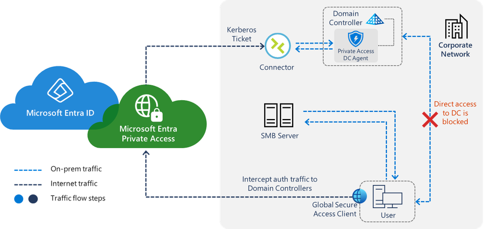

こんにちは、Azure Identity サポートチームの 張替 です。

本記事は、2024 年 5 月 16 日に米国の Azure Active Directory Identity Blog で公開された [Microsoft Entra Private Access for on-prem users - Microsoft Community Hub](https://techcommunity.microsoft.com/t5/microsoft-entra-blog/microsoft-entra-private-access-for-on-prem-users/ba-p/3905450) を意訳したものになります。ご不明点等ございましたらサポート チームまでお問い合わせください。

----

クラウドの技術とハイブリッド ワーク モデルの出現は、サイバー脅威の急速な激化と高度化とともに、人々の仕事のやり方を大きく塗り替えています。組織の境界がますます曖昧になるにつれ、かつては認証済みのユーザーにとって安全であった社内アプリケーションやリソースが、今では踏み台となったシステムやユーザーからの侵入に対して脆弱になっています。ユーザーが従来の仮想プライベート ネットワーク (VPN) を通じて企業ネットワークに接続すると、ネットワーク全体への広範なアクセスが許可されるため、潜在的に重大なセキュリティ リスクが生じます。このような課題により、従来のネットワーク セキュリティのアプローチでは対応しきれない新たな需要が生じています。Gartner 社 ([Gartner Identifies Three Factors Influencing Growth in Security Spending](https://www.gartner.com/en/newsroom/press-releases/2022-10-13-gartner-identifies-three-factors-influencing-growth-i)) でさえ、2025 年までに 70% のリモートアクセスが VPN サービスではなく ZTNA で行われると予測しています。2021 年末時点では、これは 10% 未満でした。

Microsoft Entra プライベート アクセス ([Microsoft Entra Private Access](https://www.microsoft.com/en-us/security/business/identity-access/microsoft-entra-private-access)) は、マイクロソフトの Security Service Edge (SSE) ソリューションの一部であり、ユーザーをあらゆる社内リソースやアプリケーションに安全に接続し、従来の VPN の運用の複雑さとリスクを軽減します。過剰なアクセスを排除し、攻撃者による侵害範囲の拡大を防止することで、組織のセキュリティ体制を強化します。従来の VPN による企業の保護が効果的でくなりつつある中、Microsoft Entra プライベート アクセスは、ユーザーが自宅、リモート、オフィスのいずれで作業していようと、あらゆるデバイスとネットワークから社内アプリケーションに簡単かつ安全に接続できるようにします。

## 認証にドメイン コントローラーを使用する社内アプリへのセキュアなアクセスを実現

Microsoft Entra プライベート アクセス (プレビュー) を使用すると、ネットワークへの完全なアクセスを許可することなく、あらゆるデバイスやプロトコルににおいて、オンプレミス ユーザーがドメイン コントローラー (DC) に認証してオンプレミス リソースにアクセスする際に、きめ細かくアプリごとにポリシーを構成し、多要素認証 (MFA) を実施できるようになります。また、MFA と特権 ID 管理（PIM）を適用し、DC への特権アクセスを行うことで、ID の脅威から DC を保護し、不正アクセスを防止できます。

セキュリティ体制を強化し、攻撃対象領域を最小限に抑えるには、先進認証に対応していないレガシー アプリケーションや独自開発のアプリケーションを含むすべての社内リソースとアプリケーションに MFA などの堅牢な条件付きアクセスの制御を導入することが極めて重要です。そうすることで、ネットワーク基盤の心臓部である DC を保護することが可能となります。

## オンプレミスのユーザー シナリオにおける Microsoft Entra プライベート アクセスの仕組みに迫る

Microsoft Entra プライベート アクセスは、その企業が持つ重要なサービスのセキュリティを確保しつつ、オンプレミスのリソースやアプリケーションに安全にアクセスようにし、さらに従業員がそのリソースのすぐそばにいる場合であっても、オンプレミスのリソースにスムーズにアクセスできるような方法を提供します。ある社員がその会社の本社に勤務しているような例をお考え下さい。ここで、その社員がプロジェクトの重要な情報を取得したり、変更を加えたりするために、会社の DC にアクセスする必要があるとします。しかし、DC に直接アクセスしようとすると、アクセスがブロックされていることに気づきました。これは、会社が特権アクセスを有効にしているためで、セキュリティ上の理由から DC への直接アクセスが制限されているのです。

DC に直接アクセスする代わりに、その社員のトラフィックはグローバル セキュア アクセス クライアント ([Global Secure Access Client](https://learn.microsoft.com/en-us/entra/global-secure-access/concept-clients)) によって仲介され、認証のために Microsoft Entra ID と Microsoft Entra プライベート アクセスのクラウド ネットワークにルーティングされます。これにより、認証されたユーザーのみが DC とそのリソースにアクセスできるようになります。
 
社員が必要な社内ソースにアクセスしようとすると、MFA を使用して認証するよう求められます。このセキュリティの追加レイヤーにより、正規ユーザーのみが DC にアクセスできるようになります。また、Microsoft Entra プライベート アクセスを用いることで、MFA に対応していないリソースであっても、MFA をすべてのオンプレミス リソースに適用できます。つまり、レガシー アプリケーションでさえ、MFA の追加セキュリティの恩恵を受けることができるということです。Microsoft Entra プライベート アクセスでは、アプリごとに細かく制御が可能であり、オンプレミス環境内でアクセスできるアプリケーションやリソースを特定のものだけに絞り込むということも可能です。これにより、従業員は許可されたサービスにのみアクセスできるようになり、重要なサービスのセキュリティが確保されます。
 
このようなセキュリティ対策が追加されても、従業員のユーザー体験は引き続きスムーズです。企業ネットワークから出るのは認証トラフィックだけで、アプリケーション トラフィックは企業ネットワーク内のローカルに留まります。これにより、遅延が最小限に抑えられ、従業員は必要な情報に迅速かつ効率的にアクセスできます。

図 1: Microsoft Entra プライベート アクセスは、オンプレミスのユーザーに対して、オンプレミスのリソースへの柔軟な MFA を実施し、セキュリティ体制を強化して攻撃対象領域を最小限に抑えます。

## 主なメリット: Microsoft Entra プライベート アクセスでオンプレミス リソースへのネットワーク アクセスのセキュリティを強化

オンプレミス リソースのセキュリティを強化し、ID の脅威から DC を含む重要な資産を保護しようとお考えの組織であればは、プレビュー中の Microsoft Entra プライベート アクセスが提供する主要機能から恩恵を受けることができます。Microsoft Entra プライベート アクセスでは、アクセス可能な範囲をきめ細かく制限でき、さらに条件付きアクセスの制御をすべての社内アプリケーションに拡張できます。
 
Microsoft Entra プライベート アクセスにより、認証に DC を使用する社内アプリケーションに MFA を実装することができ、これにより不正アクセスを防止し、ID 関連のリスクを低減するためのセキュリティ レイヤーを追加することができます。個々のアプリケーションまたはグループに対してきめ細かなアクセス ポリシーを有効にすることで、許可されたユーザーのみが重要なリソースやサービスとやり取りできるようにすることができます。さらに、Microsoft Entra プライベート アクセスは、レガシー プロトコルに依存するものであっても、すべての社内リソースに条件付きアクセス制御を拡張しますので、企業はアプリケーションの機密性やユーザー リスク、ネットワークの準拠状態などの要因を考慮すして、環境全体で最新の認証方法を適用可能となります。

## まとめ

Microsoft Entra プライベート アクセスを用いることで、レガシー アプリケーションと最新のセキュリティとのギャップを埋めながら、オンプレミスまたはリモートのあらゆるユーザーに対して、すべての社内アプリケーションへのきめ細かなアクセス制御が可能となります。プライベート アクセスの機能により、認証に DC を使用する社内アプリケーションへの安全なアクセスを確実に構成できますので、最新の認証とアクセス制御が絡む複雑な環境であっても、自信をもって前に進むことができるはずです。
 
今すぐ [Microsoft Entra プライベート アクセス](https://www.microsoft.com/en-ca/security/business/identity-access/microsoft-entra-private-access) のプレビューに参加して、進化するセキュリティの課題のその先に進んでまいりましょう。
 
詳しくは「[New capabilities to protect on-premises resources with MFA via Microsoft Entra Private Access](https://www.youtube.com/watch?v=_p4bzmPl7MY)」 もご覧ください。  
 
このトピックの詳細については以下もご覧ください。

[Microsoft Entra Private Access: ID を中心としたゼロ トラスト ネットアーク アクセス ソリューション | Japan Azure Identity Support Blog (jpazureid.github.io)](https://jpazureid.github.io/blog/azure-active-directory/microsoft-entra-private-access-an-identity-centric-zero-trust-network-access-solution)

