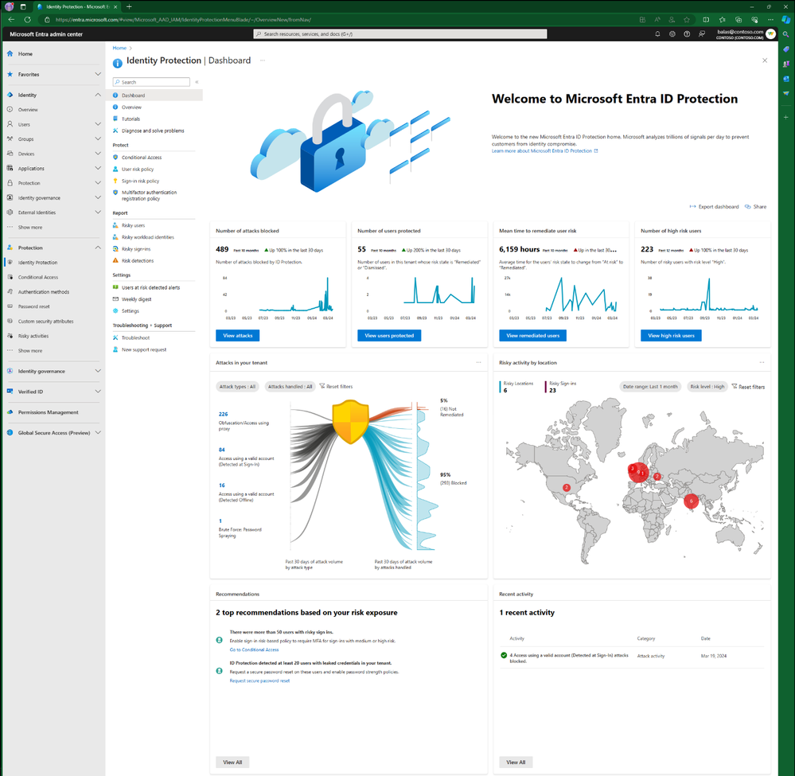
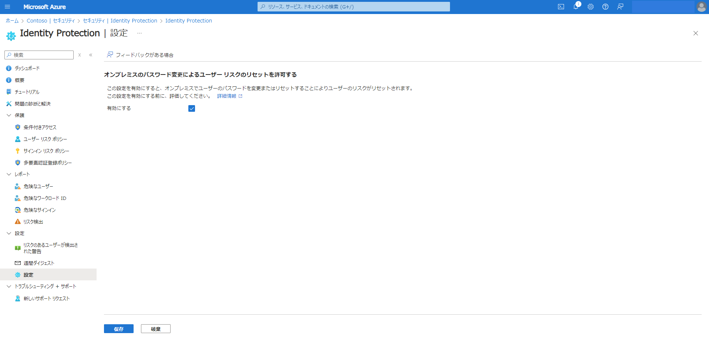
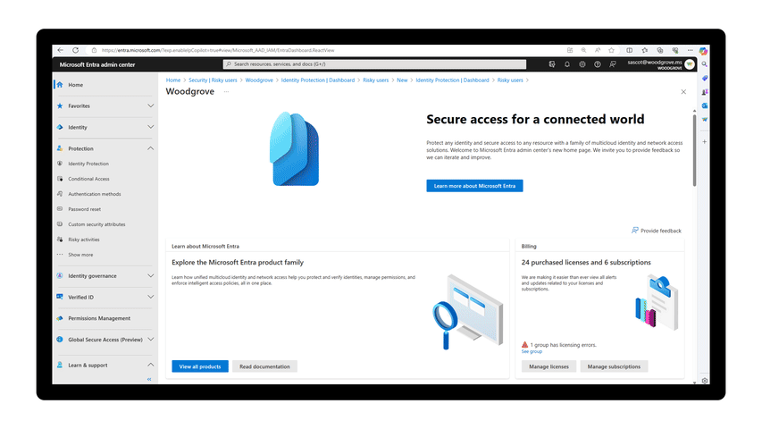

# Microsoft Entra ID Protection への新機能の展開

こんにちは、Azure Identity サポート チームの 五十嵐 です。

本記事は、2024 年 5 月 9 日に米国の Microsoft Entra (Azure AD) Blog で公開された [New developments in Microsoft Entra ID Protection](https://techcommunity.microsoft.com/t5/microsoft-entra-blog/new-developments-in-microsoft-entra-id-protection/ba-p/4062701) の抄訳です。ご不明点等ございましたらサポート チームまでお問い合わせください。

----

[Microsoft Digital Defense Report 2023 (MDDR)](https://www.microsoft.com/ja-jp/security/security-insider/microsoft-digital-defense-report-2023) では、Microsoft Entra ID のアクティブ ユーザー 10 万人あたり、平均 11 件の [トークン リプレイ攻撃](https://learn.microsoft.com/ja-jp/entra/id-protection/concept-identity-protection-risks#anomalous-token) が毎月検出されていることを紹介しました。さらに、多要素認証 (MFA) の疲労攻撃は毎月約 18,000 件観測されています。

Entra ID Protection の最新の機能を用いることで、リスク ポリシーの導入やその影響の把握、新たな脅威からの組織の保護を容易にすることで、これらの攻撃のリスクを軽減することができます。 

以下はそのハイライトです:

- **Microsoft マネージド ポリシー** と **影響分析ワークブック** により、Entra ID Protection の導入がさらに容易になりました。
- **Copilot の支援** と **ハイブリッド ユーザーが自身でリスクを修復する機能の拡張** により、**侵害されたユーザーを迅速に調査して修復できる** ようになりました。
- また、フィードバックを提供することで **機械学習 (ML) アルゴリズムをチューニングする** とともに、新しい検知により Entra ID 内で攻撃者が行った **トークンの盗難** や **不審なアクション** を特定してブロックすることができます。 

詳細については続きをご覧ください。

## 簡単かつ確実に新機能を展開

### Microsoft マネージド ポリシーと影響分析ワークブック

ID とアクセス管理は、専門知識を必要とする責任の大きい仕事です。ポリシーは、ID、インフラ、ネットワーク、デバイス、アプリ、データにまたがり、エンド ユーザーとセキュリティへの影響を考慮する必要がありますから、非常に多くのことに取り組む必要があります。お客様を支援するために、ユーザーをより早く簡単に保護できるよう弊社では 2 つの発表を行いました。

まず 11 月に発表したように、[Microsoft マネージド ポリシー](https://learn.microsoft.com/ja-jp/entra/identity/conditional-access/managed-policies) は、一部のテナントにおいて、サインイン時にリスクが検出されたら MFA を要求するなど最も効果のある条件付きアクセス ポリシーの一部を既定で有効にします。このポリシーは攻撃者をブロックし、ユーザーがリスクを自己修復できるようにもします。Microsoft マネージド ポリシーは、お客様からのフィードバックを取り入れ、お客様にとっての価値を最大化できるよう、ゆっくりと慎重に展開しています。マネージド ポリシーに対する当社のアプローチについては、[当社のドキュメント](https://learn.microsoft.com/ja-jp/entra/identity/conditional-access/managed-policies) をご覧ください。

ユーザーがリソースへ認証する方法を変更する際には慎重な検討が必要です。そういった変更がお客様固有の環境にどのような影響を与えるかを事前に把握しておくことが重要です。そこで、リスクベースのアクセスに関する新しい影響分析ワークブックを活用いただくと、リスクベースの条件付きアクセス ポリシーを有効にした場合の正確な影響を確認可能となります。このワークブックでは、過去のサインイン データを使用して、レポート専用モードのポリシーを必要とせず、ポリシーが与えるであろう影響をすぐに確認できます。新しいワークブックは [こちら](https://learn.microsoft.com/ja-jp/entra/id-protection/workbook-risk-based-policy-impact) からお試しいただけます。

## 新しいダッシュボードの一般提供開始

7 月に、Entra ID Protection は、テナントのリスク分析情報が一目でわかる [新しいダッシュボード](https://jpazureid.github.io/blog/azure-active-directory/what-s-new-with-microsoft-entra-id-protection/) を発表しました。本日、このエクスペリエンスの一般提供が開始され、ID Protection の既定のページになったことを発表いたします。このダッシュボードでは、重要な指標、グラフ、および組織のセキュリティ態勢を改善するための推奨アクションを通じて、テナントのセキュリティ態勢をよりよく理解することができます。

一般的提供に伴い、[攻撃] グラフの攻撃回数もクリックできるようになり、[リスク検出] レポートででさらに詳細を調査できるようになりました。リスク検出レポートには、新たに「攻撃タイプ」列が追加され、検出された攻撃の MITRE ATT&CK テクニックに基づく主要な攻撃の種類が表示されるようになります。これにより、管理者や SOC チームがリスクを理解し、それに応じたアクションを取ることができるようになります。リスク検知と [MITRE ATT&CK タイプのマッピング](https://learn.microsoft.com/ja-jp/entra/id-protection/id-protection-dashboard#risk-detection-type-to-mitre-attack-type-mapping) については、当社のドキュメントをご覧ください。

## 効率的な調査と修復

### オンプレミスでのパスワード リセットでユーザーが侵害されたリスクをクリア (一般提供開始)

Entra P1 および P2 のお客様向けに、オンプレミスのパスワード変更でユーザー リスクをリセットする機能が **一般提供** となります。この機能により、ユーザー パスワードの修復を求めるリスクベースの条件付きアクセス ポリシーにハイブリッド環境のユーザーを含めることが可能になります。この機能を有効にするために一般提供をお待ちくださっていたのであれば、一般提供となった今、ぜひそういったポリシーを作成ください。詳しくは、Entra ID Protection の [リスクを修復してユーザーをブロック解除する](https://learn.microsoft.com/ja-jp/entra/id-protection/howto-identity-protection-remediate-unblock#allow-on-premises-password-reset-to-remediate-user-risks) のドキュメントをご覧ください。

### ユーザー リスク調査 Copilot のパブリック プレビュー

[Copilot for Security の一部としてパブリック プレビューで提供されている](https://jpazureid.github.io/blog/azure-active-directory/microsoft-entra-adds-identity-skills-to-copilot-for-security/) Microsoft Entra の ユーザー リスク調査スキルの導入により、ユーザーのリスク レベルの詳細や、ユーザーのリスクを軽減するための推奨事項について知ることがこれまで以上に容易になりました。このスキルは、ユーザーのリスク履歴、そのユーザーのリスクを軽減する方法、ID の脅威に対する対応をどのように自動化するかという方法をまとめて教えてくれます。

## 脅威の防止ならびに修復機能の向上

ここ数ヶ月の間に、Entra ID Protection に複数の新しい検出機能が導入され、異常な Graph の使用、トークンの盗難、Attacker in the Middle (AitM) 攻撃など、新しく出現した攻撃から保護されるようになりました。さらに、ハイブリッド テナントは、パスワードがオンプレミスでリセットされたときにもユーザーのリスクが修復できるようになるとともに、イベントが危険であるかどうかを判断するにあたり、お客様のフィードバックを考慮する新機能がすべてのテナントにおいて利用可能になりました。

### 疑わしい API トラフィックの検出 (一般提供開始)

ある環境に侵入する際、攻撃者はユーザーやテナント構成に関する情報を検索し、さらなる攻撃に向けて準備することがよくあります。ID Protection は、MS Graph および AAD Graph への呼び出しがそのユーザーの通常の利用頻度と比較して異常に多いことを確認した場合、そのユーザーのリスク レベルを変更するように動作します。これにより、偵察目的で情報をあさる内部攻撃者や侵害されたユーザーの特定が容易となります。

### リアルタイムおよび侵害後のトークン盗難の検出

トークンベースの攻撃の増加に伴い、この新たな脅威を特定し、防御するための検出が必要になります。ID Protection の 2 つの新しい検出機能を用いることで、これが可能になります。業界初のリアルタイムでの異常なトークンの検出機能により、リスクベースの条件付きアクセスと組み合わせることで、サインイン時のトークン リプレイ攻撃をリアルタイムで自動的に阻止します。

また、Microsoft 365 Defender の Attacker in the Middle シグナルのカバー範囲を拡張するオフライン検出も構築しました。この検出による影響を受けたユーザーには高リスクのフラグが付けられ、構成された条件付きアクセスのユーザー リスク ポリシーが動作しますので、お客様はそのユーザーのリスクの確認や解除を行うことができます。また、継続的アクセス評価が有効になっている場合は、セッション トークンが破棄されます。

新しい検出の詳細については、[リスク検出とは](https://learn.microsoft.com/ja-jp/entra/id-protection/concept-identity-protection-risks) をご覧ください。

## 機械学習の検出に対する管理者からのフィードバック

Entra ID でのリスク検出は非常に高いレベルで行っていますが、時折、誤検出が発生することがあります。この度、危険なサインインに対して機械学習モデルのトレーニングを支援できるようになりました。サインインに対して、侵害あり、安全、またはリスクを無視するというフィードバックを選択できます。これらの各操作により、弊社の機械学習モデルに情報を送信し、お客様の組織の将来の検出が最適化されます。Entra ID Protection のリスクのフィードバックについては、[こちら](https://learn.microsoft.com/ja-jp/entra/id-protection/howto-identity-protection-risk-feedback#how-does-microsoft-entra-id-use-my-risk-feedback) をご覧ください。

お客様の組織がこれらの新しい検出と機能から恩恵を受け、リスクベースの条件付きアクセスが組織のセキュリティにさらなるプラスの影響を与えることを願っています。

ぜひご意見をお聞かせください！

Alex Weinert
